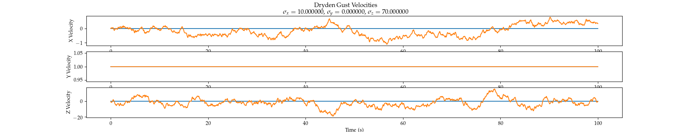

# Wind Dynamics

Algorithms for simulating 3D wind in C++ and Python.

## Model and Parameters Explanation

The DrydenWind class will generate wind velocities that deviate from a user-specified nominal value according to the [Dryden Gust Model](https://en.wikipedia.org/wiki/Dryden_Wind_Turbulence_Model), which attempts to model gusts as a stochastic process. The functions in this library provide a C++/Python implementation of the Dryden Model [in its Pseudospectral form](https://en.wikipedia.org/wiki/Dryden_Wind_Turbulence_Model#Spectral_Factorization), which means that the stochastic process is modeled by driving a transfer function with white noise. In its continuous form, the transfer function in each dimension looks like:


which provides a good approximation for small air vehicles. The model parameters are:

- **V** is the effective aircraft velocity through the medium
- **L** is the [turbulence length scale](https://www.cfd-online.com/Wiki/Turbulence_length_scale)
- **sigma** is the [turbulence intensity](https://www.cfd-online.com/Wiki/Turbulence_intensity)

In the library, **V** is assumed to be **1.0 m/s** (shouldn't be any need to modify this) and **L** is calculated from altitude (default: **2 m**) in meters.

Thus, **it is the user's responsibility to specify nominal wind velocity (m/s) and turbulence intensity for each inertial dimension**. Altitude can optionally be set, as well. Instead of trying to calculate turbulence intensity directly, it may be more convenient to build the Python bindings and experiment with sigma values, as shown below.

## Building (C++)

To use in your project, add the following lines to your *CMakeLists.txt* file:

```cmake
if (NOT TARGET wind-dynamics)
  include_directories(path/to/wind-dynamics/include)
  add_subdirectory(path/to/lib/wind-dynamics)
endif()
```

## Building (Python 3)

Pull git submodules with 

```bash
git submodule update --init --recursive
```

To build standalone python bindings for the library, execute:

```bash
cd python
cmake -DPYTHON_BINDINGS=ON ..
make
```

You can then experiment with the class and parameter examples in *python/dryden\_model\_test.py* (Python3 only) to get a feel for the individual class behaviors. The script will generate visualization plots like the ones below:



## Usage (C++)

The class *DrydenWind* must be initialized with wind velocity-defining parameters before it is used:

```c++
#include "wind-dynamics/dryden_model.h"

...

dryden_model::DrydenWind wind;
wind.initialize(const double &wx_nominal, const double &wy_nominal, const double &wz_nominal,
                const double &wx_sigma,   const double &wy_sigma,   const double &wz_sigma,
                const double &altitude=2.0);
```

The variables *w[axis]\_nominal* define the nominal wind velocity in meters/second, and the variables *w[axis]\_gust\_bound* define a loose bound on the additional gust velocity in that direction.

To get the current wind velocity, call the following:

```c++
Eigen::Vector3d wind_velocity = wind.getWind(double dt);
```

Where the variable *dt* is the amount of elapsed time in seconds since *getWind()* was last called. The *dt* variable is for the internal propagation of the Dryden gust dynamic model.

## Usage (Python 3)

Analogous to C++ usage above:

```python
import sys; sys.path.insert(1, '/path/to/wind-dynamics/python') # if your script is not in the wind-dynamics/python directory

from wind_dynamics import DrydenWind
import numpy as np

...

wind = DrydenWind()
wind.initialize(x_mean,  y_mean,  z_mean, 
                x_sigma, y_sigma, z_sigma, 2.0)

...

v_wind = wind.getWind(dt)
```
